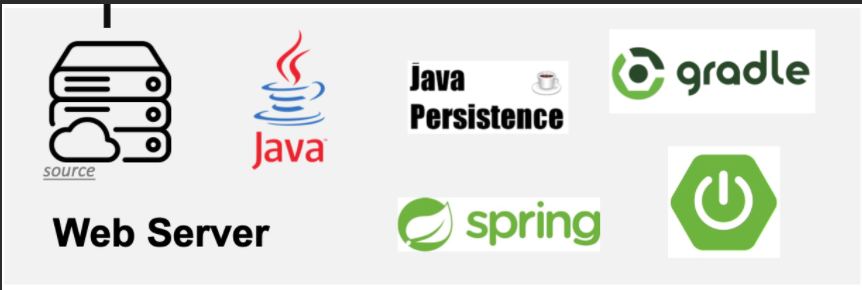
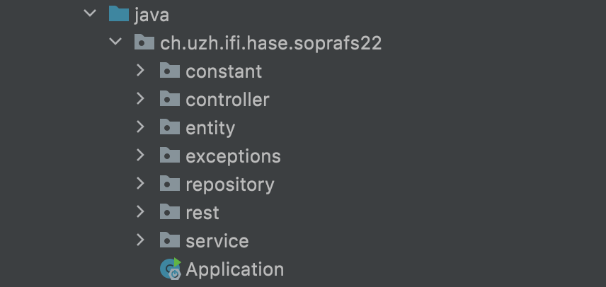
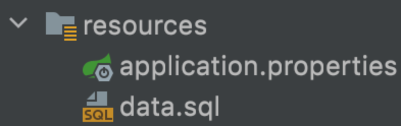

# TopTrumps
Top Trumps is an online multiplayer card game that is played by 2-5 players and is better known under 'Autoquartet'. 
The application allows friends to play games with different themed decks and allows them to create decks and 
cards by themselves and even add pictures to them to make the game more fun.
These created decks can be published so others can play with them aswell or only share them between friends.

Top trumps is a browser based multiplayer card game that can be played between 2-5 people. It allows players to play and create cards and decks for themselves, 
which can be shared with others and made public for others to use.

The game has its root in the physical card game better known as 'Autoquartet', 
which we wanted to bring to the digital world so that friends independent of their geographical location can play together.
We not only wanted a simple card game, but atotal expirience which is rounded off by being able to creating card decks and sharing them among yor friends.
Our goal is to have:
- a playable game
- functioning deck creation tool
- sharing decks among peers

## Technologies

On the server side we use the following technologies:
- **Java:** Backend logic
- **Gradle:** Building project
- **Spring/Springboot:** Run Application 
    

Details

    

  - Documentation: https://docs.spring.io/spring-boot/docs/current/reference/html/index.html
  - Guides: http://spring.io/guides
      - Building a RESTful Web Service: http://spring.io/guides/gs/rest-service/
      - Building REST services with Spring: http://spring.io/guides/tutorials/bookmarks/
    

    

## High-Level components
**Real time session based games:**
Since a game cycle is session based, the [session](https://github.com/sopra-fs22-group-10/server/blob/master/src/main/java/ch/uzh/ifi/hase/soprafs22/entity/Session.java) 
ties game and the players together. It creates a lobby and allows the transition to the game
giving it all the necessary information to start. it keeps track of the current gamestate and deletes
the used data once the players leave the game.
 
**Card creation tool**
The card creation happens on client side and allows a user to create their own cards and deck, and editing of existing decks.
This tool works together with the Unsplash API, so players can created visually pleasing cards to play with.

[Unsplash](https://unsplash.com/): External API to search for and add picture to cards, which adds more fun and immersion to the game.

## Prerequisites

Have a working programming environment or download your IDE of choice: (e.g., [Eclipse](http://www.eclipse.org/downloads/), [IntelliJ](https://www.jetbrains.com/idea/download/)), [Visual Studio Code](https://code.visualstudio.com/) and make sure Java 15 is installed on your system (for Windows-users, please make sure your JAVA_HOME environment variable is set to the correct version of Java).
1. Clone or download the [repo](https://github.com/sopra-fs22-group-10/server)
2. File -> Open... -> sopra-fs22-group-10/server
3. Accept to import the project as a `gradle project`

### VS Code

The following extensions will help you to run it more easily:

    
- `pivotal.vscode-spring-boot`

-  `vscjava.vscode-spring-initializr`

-   `vscjava.vscode-spring-boot-dashboard`

- `vscjava.vscode-java-pack`

-   `richardwillis.vscode-gradle`

**Note:** You'll need to build the project first with Gradle, just click on the
`build` command in the _Gradle Tasks_ extension. Then check the _Spring Boot Dashboard_ extension if it already shows `soprafs22` 
and hit the play button to start the server. If it doesn't show up, restart VS Code and check again.

## Running and building with Gradle

You can use the local Gradle Wrapper to build and run the application.

-   macOS: `./gradlew`
-   Linux: `./gradlew`
-   Windows: `./gradlew.bat`
    More Information about [Gradle Wrapper](https://docs.gradle.org/current/userguide/gradle_wrapper.html) and [Gradle](https://gradle.org/docs/).

### Build

To build right click the `build.gradle` file and choose `Run Build`
or use the gradle wrapper:
`./gradlew build`

### Run

Right-click on the [Application.java](https://github.com/sopra-fs22-group-10/server/blob/master/src/main/java/ch/uzh/ifi/hase/soprafs22/Application.java) file and then choose `Run 'Application'`
or use the gradle wrapper:

`./gradlew bootRun`

To test if your application works on localhost go to [http://localhost:8080/](http://localhost:8080/)
And if you can see 'Your application is running.'

### Test

`./gradlew test`

Have a look here: https://www.baeldung.com/spring-boot-testing

### Development Mode 

Expand:
 

You can start the backend in development mode, this will automatically trigger a new build and reload the application
once the content of a file has been changed and you save the file.

Start two terminal windows and run:

`./gradlew build --continuous`

and in the other one:

`./gradlew bootRun`

If you want to avoid running all tests with every change, use the following command instead:

`./gradlew build --continuous -xtest`

## Debugging

If something is not working and/or you don't know what is going on. We highly recommend that you use a debugger and step
through the process step-by-step.

To configure a debugger for SpringBoot's Tomcat servlet (i.e. the process you start with `./gradlew bootRun` command),
do the following:

1. Open Tab: **Run**/Edit Configurations
2. Add a new Remote Configuration and name it properly
3. Start the Server in Debug mode: `./gradlew bootRun --debug-jvm`
4. Press `Shift + F9` or the use **Run**/Debug"Name of your task"
5. Set breakpoints in the application where you need it
6. Step through the process one step at a time

## Deployment to Heroku
To deploy the applocation to heroku you just have to push to the [sopra-fs22-group-10/server](https://github.com/sopra-fs22-group-10/server)
repository and GitHub and make sure your push is merged to main. It may take some time but to check if the application
is running check on [https://sopra-fs22-group-10-server.herokuapp.com/](https://sopra-fs22-group-10-server.herokuapp.com/).
If you see 'The application is running.' The server is deployed.

## Illustrations:
Below you can see the main folders.

**Controller**
The Controller handles all the incoming HTTP request from the client-side
and calls the necessary classes to answer request.

**Exceptions** Is used for error handling Has all the throwable exceptions 
which will be sent to client side if something goes wrong

**Repository**
Are used to define the and alter the Database Mapping between database tables and objects.

**Rest**
Contains the domain classes for the API usage and maps internal and external objects.
Represents the access point of domain classes and contains all the DTO Mappers

**Service**
Its classes help the controller to handle the logic behind the actions.

**Entity**
Contains all the Entities of the application

**Application** Is used to run the application.

In the resource-folder is located the data.sql file which is used
to add data to the database when it's starting up. here we add the Template decks
that users have when they create an account.

## Roadmap
If you wish to add change/improve the code here are some suggestions to work on:
    
- Implement a fairness check for user created decks, that notifies the users to alter the deck and make it fairer/funnier to play with
- Add the possibility for users to create a deck together in a session
- Add a feature for users to communicate which each others (important when users create decks together

## Authors and Acknowledgement
[andreas-wiemeyer](https://github.com/andreas-wiemeyer)

[UlricaK](https://github.com/UlricaK)

[mattialeonetti](https://github.com/mattialeonetti)

[timvorburger](https://github.com/timvorburger)

[Atsrivi](https://github.com/Atsrivi)

We are thankful to our TA [SamuelBruegger](https://github.com/SamuelBruegger) for his support during this project.

